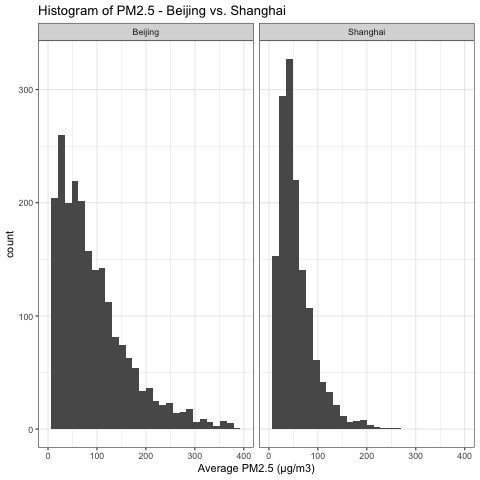
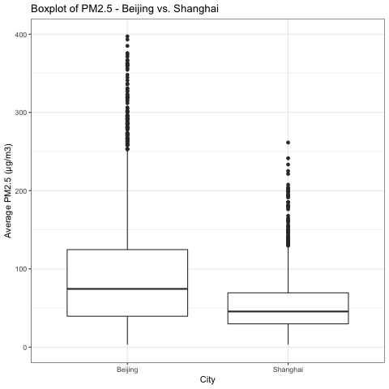
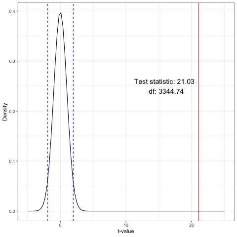

DSCI 522 Analysis of PM 2.5 in Beijing and Shanghai
================
Ting Pan, Weishun Deng
November 22, 2018

Report
======

Introduction
------------

This project is to conduct research on the inferential question - **Is the average PM2.5 in Beijing same as that in Shanghai?** We want to explore whether the average PM2.5 in Beijing is different from that in Shanghai in general. The datasets we choose are [PM2.5 Data of Five Chinese Cities from Kaggle.com](https://www.kaggle.com/uciml/pm25-data-for-five-chinese-cities), which record PM2.5 of five Chinese cities during 2010 to 2015 each day each hour. Because we only care about PM2.5 in Beijing and Shanghai, these two raw datasets are as below:

*Table 1. Beijing PM2.5 Raw Dataset*
<table class="table" style="margin-left: auto; margin-right: auto;">
<thead>
<tr>
<th style="text-align:right;">
No
</th>
<th style="text-align:right;">
year
</th>
<th style="text-align:right;">
month
</th>
<th style="text-align:right;">
day
</th>
<th style="text-align:right;">
hour
</th>
<th style="text-align:right;">
PM\_Dongsi
</th>
<th style="text-align:right;">
PM\_Dongsihuan
</th>
<th style="text-align:right;">
PM\_Nongzhanguan
</th>
<th style="text-align:right;">
PM\_US.Post
</th>
</tr>
</thead>
<tbody>
<tr>
<td style="text-align:right;">
1
</td>
<td style="text-align:right;">
2010
</td>
<td style="text-align:right;">
1
</td>
<td style="text-align:right;">
1
</td>
<td style="text-align:right;">
0
</td>
<td style="text-align:right;">
NA
</td>
<td style="text-align:right;">
NA
</td>
<td style="text-align:right;">
NA
</td>
<td style="text-align:right;">
NA
</td>
</tr>
<tr>
<td style="text-align:right;">
2
</td>
<td style="text-align:right;">
2010
</td>
<td style="text-align:right;">
1
</td>
<td style="text-align:right;">
1
</td>
<td style="text-align:right;">
1
</td>
<td style="text-align:right;">
NA
</td>
<td style="text-align:right;">
NA
</td>
<td style="text-align:right;">
NA
</td>
<td style="text-align:right;">
NA
</td>
</tr>
<tr>
<td style="text-align:right;">
3
</td>
<td style="text-align:right;">
2010
</td>
<td style="text-align:right;">
1
</td>
<td style="text-align:right;">
1
</td>
<td style="text-align:right;">
2
</td>
<td style="text-align:right;">
NA
</td>
<td style="text-align:right;">
NA
</td>
<td style="text-align:right;">
NA
</td>
<td style="text-align:right;">
NA
</td>
</tr>
<tr>
<td style="text-align:right;">
4
</td>
<td style="text-align:right;">
2010
</td>
<td style="text-align:right;">
1
</td>
<td style="text-align:right;">
1
</td>
<td style="text-align:right;">
3
</td>
<td style="text-align:right;">
NA
</td>
<td style="text-align:right;">
NA
</td>
<td style="text-align:right;">
NA
</td>
<td style="text-align:right;">
NA
</td>
</tr>
<tr>
<td style="text-align:right;">
5
</td>
<td style="text-align:right;">
2010
</td>
<td style="text-align:right;">
1
</td>
<td style="text-align:right;">
1
</td>
<td style="text-align:right;">
4
</td>
<td style="text-align:right;">
NA
</td>
<td style="text-align:right;">
NA
</td>
<td style="text-align:right;">
NA
</td>
<td style="text-align:right;">
NA
</td>
</tr>
<tr>
<td style="text-align:right;">
6
</td>
<td style="text-align:right;">
2010
</td>
<td style="text-align:right;">
1
</td>
<td style="text-align:right;">
1
</td>
<td style="text-align:right;">
5
</td>
<td style="text-align:right;">
NA
</td>
<td style="text-align:right;">
NA
</td>
<td style="text-align:right;">
NA
</td>
<td style="text-align:right;">
NA
</td>
</tr>
</tbody>
</table>
There are four monitoring sites in Beijing:Dongsi, Dongsihuan, Nongzhanguan, US.Post.

*Table 2. Shanghai PM2.5 Raw Dataset*
<table class="table" style="margin-left: auto; margin-right: auto;">
<thead>
<tr>
<th style="text-align:right;">
No
</th>
<th style="text-align:right;">
year
</th>
<th style="text-align:right;">
month
</th>
<th style="text-align:right;">
day
</th>
<th style="text-align:right;">
hour
</th>
<th style="text-align:right;">
PM\_Jingan
</th>
<th style="text-align:right;">
PM\_US.Post
</th>
<th style="text-align:right;">
PM\_Xuhui
</th>
</tr>
</thead>
<tbody>
<tr>
<td style="text-align:right;">
1
</td>
<td style="text-align:right;">
2010
</td>
<td style="text-align:right;">
1
</td>
<td style="text-align:right;">
1
</td>
<td style="text-align:right;">
0
</td>
<td style="text-align:right;">
NA
</td>
<td style="text-align:right;">
NA
</td>
<td style="text-align:right;">
NA
</td>
</tr>
<tr>
<td style="text-align:right;">
2
</td>
<td style="text-align:right;">
2010
</td>
<td style="text-align:right;">
1
</td>
<td style="text-align:right;">
1
</td>
<td style="text-align:right;">
1
</td>
<td style="text-align:right;">
NA
</td>
<td style="text-align:right;">
NA
</td>
<td style="text-align:right;">
NA
</td>
</tr>
<tr>
<td style="text-align:right;">
3
</td>
<td style="text-align:right;">
2010
</td>
<td style="text-align:right;">
1
</td>
<td style="text-align:right;">
1
</td>
<td style="text-align:right;">
2
</td>
<td style="text-align:right;">
NA
</td>
<td style="text-align:right;">
NA
</td>
<td style="text-align:right;">
NA
</td>
</tr>
<tr>
<td style="text-align:right;">
4
</td>
<td style="text-align:right;">
2010
</td>
<td style="text-align:right;">
1
</td>
<td style="text-align:right;">
1
</td>
<td style="text-align:right;">
3
</td>
<td style="text-align:right;">
NA
</td>
<td style="text-align:right;">
NA
</td>
<td style="text-align:right;">
NA
</td>
</tr>
<tr>
<td style="text-align:right;">
5
</td>
<td style="text-align:right;">
2010
</td>
<td style="text-align:right;">
1
</td>
<td style="text-align:right;">
1
</td>
<td style="text-align:right;">
4
</td>
<td style="text-align:right;">
NA
</td>
<td style="text-align:right;">
NA
</td>
<td style="text-align:right;">
NA
</td>
</tr>
<tr>
<td style="text-align:right;">
6
</td>
<td style="text-align:right;">
2010
</td>
<td style="text-align:right;">
1
</td>
<td style="text-align:right;">
1
</td>
<td style="text-align:right;">
5
</td>
<td style="text-align:right;">
NA
</td>
<td style="text-align:right;">
NA
</td>
<td style="text-align:right;">
NA
</td>
</tr>
</tbody>
</table>
There are three monitoring sites in Shanghai:Jingan, US.Post, Xuhui.

As you can see from the heads of two tables above, there are a lot of missing data in our datasets. There are several kinds of missing data in our datasets:

-   There are ***no*** PM2.5 data at some specific hour.

-   There are missing data at monitoring sites and there are usually only one or two sites recording PM2.5 data. This is very typical in our datasets.

-   On some day, there are missing data for whole day.

To analyze the data efficiently, we need to deal the missing data carefully. We plan to do data wrangling on `Table 1` and `Table 2` as follows:

-   For each table, add a column `PM_Average` to record the average PM2.5 each day by removing all the missing data on that day and calculating the average of all non-NA values.

-   For each table, add a column `city` to indicate this categorical variable.

-   Combine the two tables into one, which is `Table 3`.

*Table 3. Beijing and Shanghai PM2.5 Tidy Dataset*
<table class="table" style="margin-left: auto; margin-right: auto;">
<thead>
<tr>
<th style="text-align:right;">
year
</th>
<th style="text-align:right;">
month
</th>
<th style="text-align:right;">
day
</th>
<th style="text-align:right;">
PM\_Average
</th>
<th style="text-align:left;">
city
</th>
</tr>
</thead>
<tbody>
<tr>
<td style="text-align:right;">
2010
</td>
<td style="text-align:right;">
1
</td>
<td style="text-align:right;">
1
</td>
<td style="text-align:right;">
129.0000
</td>
<td style="text-align:left;">
Beijing
</td>
</tr>
<tr>
<td style="text-align:right;">
2010
</td>
<td style="text-align:right;">
1
</td>
<td style="text-align:right;">
1
</td>
<td style="text-align:right;">
NA
</td>
<td style="text-align:left;">
Shanghai
</td>
</tr>
<tr>
<td style="text-align:right;">
2010
</td>
<td style="text-align:right;">
1
</td>
<td style="text-align:right;">
2
</td>
<td style="text-align:right;">
144.3333
</td>
<td style="text-align:left;">
Beijing
</td>
</tr>
<tr>
<td style="text-align:right;">
2010
</td>
<td style="text-align:right;">
1
</td>
<td style="text-align:right;">
2
</td>
<td style="text-align:right;">
NA
</td>
<td style="text-align:left;">
Shanghai
</td>
</tr>
<tr>
<td style="text-align:right;">
2010
</td>
<td style="text-align:right;">
1
</td>
<td style="text-align:right;">
3
</td>
<td style="text-align:right;">
78.3750
</td>
<td style="text-align:left;">
Beijing
</td>
</tr>
<tr>
<td style="text-align:right;">
2010
</td>
<td style="text-align:right;">
1
</td>
<td style="text-align:right;">
3
</td>
<td style="text-align:right;">
NA
</td>
<td style="text-align:left;">
Shanghai
</td>
</tr>
</tbody>
</table>
Visualization
-------------

To understand the tidy dataset, we take two plots to visualize it.

### Histogram

*Figure 1. Histograms of Beijing PM2.5 and Shanghai PM2.5*

`Figure 1.` shows the distributions of PM2.5 in Shanghai and Beijing. Both are right-skewed. Looking at the distribution of Beijing, the peak occurs at 25, and the data spread is from about 0 to 400. In contrast, the peak in distribution of Shanghai occurs at 50, which is larger than that of Beijing. The data spread of Shanghai is from 0 to 250, which is much narrower.

### Boxplot

*Figure 2. Boxplots of Beijing PM and Shanghai PM*

`Figure 2.` helps analyze the relationship between the categorical variable `city` and the continuous variable `PM_Average`. We observe that the median PM2.5 of Beijing is higher than that of Beijing. Also, the boxplot of Shanghai is comparatively short, which suggests that overall PM2.5 values of Shanghai are denser. In addition, they both have much outliers, which reveals that there are a lot of ralatively high PM2.5 values detected in both cities.

Data Summary
------------

For each city, we can easily get the sample size, the sample mean, and the standard deviation of the sample mean. Then, assuming statistical independence of the two groups, the standard error of the mean of each city can be estimated as the sample standard deviation divided by the square root of the sample size `SE = s / sqrt(n)`. Additionally, we calculate 95% confidence interval of PM2.5 for each city using asymoptotic theory:

Confidence Interval = (mean - 1.96 \* SE, mean + 1.96 \* SE).

*Table 4. Summarize Beijing and Shanghai PM2.5 Tidy Dataset*

<table class="table" style="margin-left: auto; margin-right: auto;">
<thead>
<tr>
<th style="text-align:left;">
city
</th>
<th style="text-align:right;">
number of sample
</th>
<th style="text-align:right;">
mean
</th>
<th style="text-align:right;">
standard deviation
</th>
<th style="text-align:right;">
lower bound of C.I.
</th>
<th style="text-align:right;">
upper bound of C.I.
</th>
</tr>
</thead>
<tbody>
<tr>
<td style="text-align:left;">
Beijing
</td>
<td style="text-align:right;">
2155
</td>
<td style="text-align:right;">
95.21643
</td>
<td style="text-align:right;">
1.6473701
</td>
<td style="text-align:right;">
91.98765
</td>
<td style="text-align:right;">
98.44522
</td>
</tr>
<tr>
<td style="text-align:left;">
Shanghai
</td>
<td style="text-align:right;">
1460
</td>
<td style="text-align:right;">
54.81167
</td>
<td style="text-align:right;">
0.9888218
</td>
<td style="text-align:right;">
52.87362
</td>
<td style="text-align:right;">
56.74973
</td>
</tr>
</tbody>
</table>
First thing we can find out from `Table 4` is that they have different sizes of non-NA data. There should be 2191 days bwtween Jan 1st 2010 to Dec 31st, 2015, however, PM2.5 only recorded 2155 days in Beijing and 1460 days in Shanghai.

We also find that the PM2.5 means of Beijing and Shanghai are totally different. Furthermore, we are 95% confident that the average PM2.5 in Beijing is between 91.98765 and 98.44522. Comparatively, we are 95% confident that the average PM2.5 in Shanghai is between 52.87362 and 56.74973.

Analysis and results
--------------------

We performed the Welch's two sample t-test intead of student t-test in this case. The main reason is that we have a lot of missing data in both of our datasets and the sizes of two samples are different so the homogeneous assumption of student t-test may not be hold. Another reason is that when we perform Welch's t-test we will not pool the sample standard deviations and this could give us a more accurate result.

The following is our test result:

\*Table 5. Results of two-sample t-test

<table class="table" style="margin-left: auto; margin-right: auto;">
<thead>
<tr>
<th style="text-align:right;">
estimate
</th>
<th style="text-align:right;">
statistic
</th>
<th style="text-align:right;">
p-value
</th>
<th style="text-align:right;">
degree of freedom
</th>
<th style="text-align:right;">
lower bound of C.I.
</th>
<th style="text-align:right;">
upper bound of C.I.
</th>
<th style="text-align:left;">
method
</th>
<th style="text-align:left;">
alternative
</th>
</tr>
</thead>
<tbody>
<tr>
<td style="text-align:right;">
40.40476
</td>
<td style="text-align:right;">
21.02933
</td>
<td style="text-align:right;">
2.597003e-92
</td>
<td style="text-align:right;">
3344.741
</td>
<td style="text-align:right;">
36.63762
</td>
<td style="text-align:right;">
44.17191
</td>
<td style="text-align:left;">
Welch Two Sample t-test
</td>
<td style="text-align:left;">
two.sided
</td>
</tr>
</tbody>
</table>
As we can see in `Table 5`, p-value is extremely small and this is a strong evidence to reject the null hypothesis.

*Figure 3. Density curve of the corresponding t-distribution, 95% threshold and test statistic*

The above plot shows that our test statistic is far right of the threshold and this is another evidence to reject the null hypothesis.

In conclusion, we reject the null hypothesis that there's no difference between the average PM2.5 in Beijing and Shanghai.

Beyond the project
------------------

There are some limitations in our analysis:

-   Due to the missing data, there are several issues about our test. Firstly, we could not have an accurate PM2.5 value for each day. Secondly, there are a lot of days missing PM2.5 values completely so we could not have a symmetric datasets, let alone the assumptions of t-test.

-   The datasets we are using are time series data which means there exists dependencies in the datasets. For example, there could be a strong relationship between today's PM2.5 and tomorrow's PM2.5.

-   We have ignore many valuable features in the datasets due to time constraint. For example, we could include humidity and temperature of each day and create a regression model with PM2.5 value.

Reference
---------

-   UCI. “PM2.5 Data of Five Chinese Cities.” RSNA Pneumonia Detection Challenge | Kaggle, 22 Aug. 2017, <http://www.kaggle.com/uciml/pm25-data-for-five-chinese-cities>.

-   “Welch's t-Test.” Wikipedia, Wikimedia Foundation, 25 Oct. 2018, <http://en.wikipedia.org/wiki/Welch's_t-test>.
